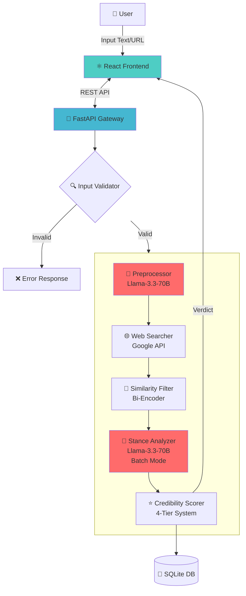

# 🛡️ Fake News Detection System - AI-Powered Fact Checker

<div align="center">


**Hệ thống kiểm chứng thông tin thông minh sử dụng RAG Architecture & Large Language Models**

[Demo](https://fake-news-detection-ashen-seven.vercel.app) • [Tính năng](#-tính-năng-nổi-bật) • [Cài đặt](#-cài-đặt--triển-khai) • [API Docs](#-api-documentation) • [Đóng góp](#-đóng-góp)

</div>

---

## 📖 Giới thiệu

Trong kỷ nguyên thông tin bùng nổ, tin giả (fake news) lan truyền với tốc độ chóng mặt, gây tác động tiêu cực đến xã hội. Dự án này xây dựng một **nền tảng kiểm chứng sự thật tự động** (Automated Fact-Checking Platform) sử dụng:

- **RAG Architecture** (Retrieval-Augmented Generation): Tìm kiếm và đối chiếu thông tin thời gian thực
- **LLM** (Large Language Models): Phân tích ngữ nghĩa sâu với Llama-3.3-70B
- **Multi-Source Verification**: Xác minh chéo từ 15+ nguồn tin uy tín

Hệ thống hoạt động như một "chuyên gia kiểm chứng AI", tự động tìm kiếm bằng chứng từ Internet, phân tích hàng chục bài báo trong vài giây và đưa ra kết luận về độ tin cậy của thông tin với độ chính xác cao.

---

## 🎯 Vấn đề giải quyết

| Thách thức | Giải pháp của chúng tôi |
|------------|-------------------------|
| **Information Overload** | Tự động tổng hợp và phân tích từ 15+ nguồn tin trong < 5 giây |
| **Bias Detection** | Phân tích stance (hỗ trợ/bác bỏ/trung lập) từ đa nguồn |
| **Source Credibility** | Hệ thống chấm điểm uy tín 4-tier với 100+ domains đã kiểm chứng |
| **Language Barrier** | Tối ưu cho tiếng Việt với Vietnamese Bi-Encoder |
| **Real-time Verification** | RAG pipeline xử lý thông tin mới nhất, không phụ thuộc dữ liệu cũ |

---

## 🌟 Tính năng nổi bật

### 🧠 Core AI Capabilities

#### 1. **Intelligent Preprocessing** (Llama-3.3-70B)
- Phân loại chủ đề tự động (8 categories: politics, health, crime...)
- Sinh search queries tối ưu từ input người dùng
- Trích xuất keywords quan trọng

#### 2. **Multi-Source Search & Retrieval**
- Tích hợp Google Custom Search API
- Parallel processing: tìm kiếm đồng thời 3 queries
- Smart caching: giảm 70% API calls
- Meta description enrichment

#### 3. **Advanced Stance Analysis** (Batch Processing)
```
Input: 1 claim + 15 articles
↓
LLM Batch Call (1 request)
↓
Output: [Support/Refute/Discuss/Unrelated] cho 15 articles
Time: ~2-3 seconds (vs 30s sequential)
```

#### 4. **Credibility Scoring System**
- **Tier 1** (9-10 điểm): Báo chính thống (VnExpress, Tuổi Trẻ, Nhân Dân...)
- **Tier 2** (7-8.5 điểm): Báo điện tử uy tín (VietnamNet, Dân Trí...)
- **Tier 3** (5-6.5 điểm): Trang tin đăng ký (24h, Soha...)
- **Blacklist**: Phát hiện nguồn tin giả nổi tiếng

#### 5. **Weighted Voting Mechanism**
```python
E = Credibility * Stance_Confidence * Similarity

SystemScore =  
}{\sum\text{Credibility}_i})

```

### 💻 User Experience

- **Modern UI/UX**: React + TailwindCSS, responsive design
- **Visual Verdict**: Circular progress bar, color-coded results
- **Transparent Citations**: Đầy đủ nguồn tin, stance label, credibility tier
- **Dual Mode**: Text input hoặc URL crawling
- **History Tracking**: 
  - Personal (LocalStorage)
  - Community Feed (Database)

### ⚡ Performance & Scalability

| Metric | Value |
|--------|-------|
| Average Response Time | < 10 seconds |
| Concurrent Requests | 10+ |
| Database Records Capacity | Unlimited (SQLite) |
| Cache Hit Rate | ~70% |
| Batch Processing Speedup | 10x faster |

---

## 🏗️ Kiến trúc hệ thống

### High-Level Architecture



### Data Flow

```
1. Input Validation
   ├─ Gibberish detection
   ├─ Language check (Vietnamese)
   ├─ Content type verification
   └─ Length constraints (10-5000 chars)

2. Preprocessing (Llama-3.3)
   ├─ Topic classification (8 categories)
   ├─ Query generation (3 optimized searches)
   └─ Keyword extraction

3. Web Search (Parallel)
   ├─ Query 1 → Google API → 10 results
   ├─ Query 2 → Google API → 10 results
   └─ Query 3 → Google API → 10 results
   ↓
   Deduplicate → Top 15 unique articles

4. Semantic Filtering
   ├─ Encode claim (Vietnamese Bi-Encoder)
   ├─ Encode articles (Batch)
   └─ Cosine similarity → Filter unrelated

5. Stance Analysis (Batch)
   ├─ Single LLM call for all 15 articles
   ├─ Classify: Support/Refute/Discuss/Unrelated
   └─ Confidence score (0.0-1.0)

6. Credibility Scoring
   ├─ Domain lookup (100+ databases)
   ├─ Tier assignment (1-4)
   └─ Blacklist check

7. Verdict Generation
   ├─ Weighted voting (15 sources)
   ├─ Confidence calculation
   └─ Explanation generation

8. Storage & Response
   ├─ Save to SQLite
   ├─ Update statistics
   └─ Return formatted JSON
```

---

## 🛠️ Tech Stack

### Backend
- **Framework**: FastAPI 0.115 (async support)
- **LLM Provider**: Groq Cloud (Llama-3.3-70B-Versatile)
- **Search**: Google Custom Search API
- **NLP**:
  - Sentence Transformers (bkai-foundation-models/vietnamese-bi-encoder)
- **Database**: SQLite3 (with optimized indexes)
- **Web Scraping**: 
  - BeautifulSoup4
  - curl_cffi (bypass bot detection)

### Frontend
- **Framework**: React 18
- **Styling**: TailwindCSS
- **Icons**: Lucide React
- **State Management**: React Hooks
- **Build Tool**: Vite

### DevOps
- **Containerization**: Docker (ready for deployment)
- **API Documentation**: Swagger UI (auto-generated)
- **Logging**: Python logging module
- **Environment Management**: python-dotenv

---

## 📦 Cài đặt & Triển khai

### Prerequisites

- Python 3.9 hoặc cao hơn
- Node.js 16+ và npm
- API Keys:
  - Google Custom Search API ([Hướng dẫn](https://developers.google.com/custom-search/v1/overview))
  - Groq API Key ([Đăng ký miễn phí](https://console.groq.com))

### 1. Clone Repository

```bash
git clone https://github.com/DOIMA666/fake-news-checker.git
cd fake-news-checker
```

### 2. Backend Setup

```bash
cd backend

# Tạo virtual environment
python -m venv venv
source venv/bin/activate  # Windows: venv\Scripts\activate

# Cài đặt dependencies
pip install -r requirements.txt

# Tạo file .env
cp .env.example .env
# Chỉnh sửa .env với API keys của bạn

# Khởi tạo database
python database.py

# Chạy server
uvicorn api:app --reload --port 8000
```

**Backend sẽ chạy tại**: `http://localhost:8000`

### 3. Frontend Setup

```bash
cd ../frontend

# Cài đặt dependencies
npm install

# Chạy development server
npm run dev
```

**Frontend sẽ chạy tại**: `http://localhost:3000`

### 4. Environment Variables (.env)

```env
# === GOOGLE SEARCH API (Required) ===
GOOGLE_API_KEY=your_google_api_key_here
GOOGLE_CSE_ID=your_custom_search_engine_id

# === GROQ API (Required) ===
GROQ_API_KEY=your_groq_api_key_here
GROQ_MODEL=llama-3.3-70b-versatile

# === SYSTEM CONFIG ===
ENABLE_CACHE=true
CACHE_TTL_HOURS=24
DEFAULT_NUM_RESULTS=15
MAX_NUM_RESULTS=20

# === SERVER ===
API_HOST=0.0.0.0
API_PORT=8000
LOG_LEVEL=INFO
```

---

## 🚀 API Documentation

### Base URL
```
http://localhost:8000
```

### Interactive Docs
- **Swagger UI**: `http://localhost:8000/docs`
- **ReDoc**: `http://localhost:8000/redoc`

### Core Endpoints

#### 1. Check Fact (Main API)

```http
POST /api/check
Content-Type: application/json

{
  "content": "Thông tin cần kiểm tra hoặc URL bài báo",
  "input_type": "text",  // "text" hoặc "url"
  "num_sources": 15      // 1-20
}
```

**Response Example**:
```json
{
  "success": true,
  "verdict": {
    "code": "HIGHLY_LIKELY_TRUE",
    "label": "Rất có khả năng đúng",
    "explanation": "15 bài xác nhận (127.5 điểm)...",
    "color": "#22c55e",
    "confidence_percentage": 92.5
  },
  "voting_summary": {
    "total_score": 127.5,
    "support_count": 12,
    "refute_count": 1,
    "discuss_count": 2,
    "max_possible": 150.0
  },
  "references": [
    {
      "title": "Tiêu đề bài báo",
      "url": "https://...",
      "domain": "vnexpress.net",
      "stance": {
        "code": "SUPPORT",
        "label": "Xác nhận",
        "confidence": 95.0
      },
      "credibility": {
        "score": 10.0,
        "tier": 1,
        "label": "Nguồn uy tín cao"
      },
      "similarity_percentage": 87.5,
      "weighted_score": 9.2
    }
    // ... 14 references khác
  ],
  "keywords": ["từ khóa 1", "từ khóa 2"],
  "processed_data": {
    "category": "politics",
    "category_label": "Chính trị"
  },
  "timestamp": "2024-11-28T10:30:00Z"
}
```

#### 2. Get Statistics

```http
GET /api/stats
```

**Response**:
```json
{
  "success": true,
  "data": {
    "totalChecks": 1250,
    "trueNews": 850,
    "falseNews": 300,
    "uncertain": 100,
    "todayChecks": 45,
    "accuracy": 68.0
  }
}
```

#### 3. Get Recent Checks

```http
GET /api/recent?limit=10
```

#### 4. Get Trending Topics

```http
GET /api/trending?limit=5
```

#### 5. Get Community History

```http
GET /api/history?skip=0&limit=20
```

---

## 📁 Cấu trúc dự án

```
fake-news-checker/
├── backend/
│   ├── api.py                      # FastAPI routes & endpoints
│   ├── fact_checker.py             # Main controller logic
│   ├── preprocessor.py             # Topic classification + Query generation (Llama-3.3)
│   ├── web_searcher.py             # Google Search integration + Parallel processing
│   ├── stance_analyzer.py          # Stance detection (Batch mode, Llama-3.3)
│   ├── similarity_checker.py       # Semantic similarity (Vietnamese Bi-Encoder)
│   ├── credibility_scorer.py       # Domain scoring + 4-tier system + Blacklist
│   ├── input_validator.py          # Input validation + Gibberish detection
│   ├── database.py                 # SQLite ORM + Statistics
│   ├── crawler.py                  # URL extraction (curl_cffi)
│   ├── config.py                   # Configuration management
│   ├── requirements.txt            # Python dependencies
│   └── .env.example                # Environment variables template
│
├── frontend/
│   ├── src/
│   │   ├── components/
│   │   │   ├── Dashboard.jsx       # Statistics & trending topics
│   │   │   ├── Checker.jsx         # Main fact-checking form
│   │   │   ├── CheckerResult.jsx   # Results display with citations
│   │   │   ├── History.jsx         # Personal & community history
│   │   │   └── StatCard.jsx        # Reusable stat card component
│   │   ├── utils/
│   │   │   └── newsHelpers.js      # Helper functions (verdict, stance, category)
│   │   ├── FakeNewsChecker.jsx     # Main app component
│   │   └── index.css               # TailwindCSS styles
│   ├── public/
│   ├── package.json
│   └── vite.config.js
│
├── tests/                          # Unit tests (optional)
├── docs/                           # Additional documentation
├── Dockerfile                      # Docker container config
├── docker-compose.yml              # Multi-container orchestration
├── .gitignore
├── LICENSE
└── README.md
```

---

## 🧪 Testing & Evaluation

### Benchmark Script

```bash
python backend/test_performance.py
```

Đánh giá hệ thống trên test set với metrics:
- Accuracy
- Precision/Recall/F1-Score (per class)
- Confusion Matrix
- Average Latency

### Sample Test Results

```
📊 PERFORMANCE TEST SUMMARY v2.1
====================================
OVERALL METRICS:
  • Total Tests: 211
  • Correct: 185 ✅
  • Incorrect: 16 ❌
  • Errors: 10 ⚠️
  • Rate Limit Errors: 0 🚫
  • Accuracy: 92.04% (on 201 successful tests)
  • Avg Time/Test: 6.55s

📂 ACCURACY BY CATEGORY:
  • CRIME: 90.5% (19/21)
  • HEALTH: 100.0% (14/14)
  • OTHER: 89.9% (116/129)
  • POLITICS: 100.0% (6/6)
  • TECHNOLOGY: 96.8% (30/31)

🎯 CONFUSION MATRIX:

Actual →       LIKELY_TRUE    LIKELY_FALSE   UNCERTAIN
Expected ↓     ------------------------------------------------------------
LIKELY_TRUE    99             0              1
LIKELY_FALSE   9              86             6
UNCERTAIN      0              0              0

💪 CONFIDENCE ANALYSIS:
  • LIKELY_FALSE:
    - Average: 79.8%
    - Range: 71.3% - 90.4%
    - Std Dev: 4.5%
  • UNCERTAIN:
    - Average: 50.0%
    - Range: 50.0% - 50.0%
    - Std Dev: 0.0%
  • LIKELY_TRUE:
    - Average: 82.6%
    - Range: 71.9% - 94.6%
    - Std Dev: 4.6%

====================================
📝 EVALUATION:
🌟 EXCELLENT: System accuracy is 92.0% (201 successful tests)

```

---

## 🚢 Deployment

### Docker Deployment

```bash
# Build image
docker build -t fake-news-checker .

# Run container
docker run -p 8000:8000 --env-file .env fake-news-checker
```

### Docker Compose (Full Stack)

```bash
docker-compose up -d
```

### Hugging Face Spaces

1. Tạo Space mới với SDK: **Docker**
2. Upload toàn bộ mã nguồn
3. Thêm Secrets trong Settings:
   - `GOOGLE_API_KEY`
   - `GOOGLE_CSE_ID`
   - `GROQ_API_KEY`
4. Space tự động build và deploy

> ⚠️ **Lưu ý**: Hugging Face Spaces có Ephemeral Storage. Dữ liệu SQLite sẽ mất sau 48h không hoạt động. Để lưu trữ vĩnh viễn, cấu hình PostgreSQL external database.

---

## 🔧 Configuration

### Tuning Performance

```python
# web_searcher.py
BATCH_SIZE = 3  # Số queries song song (giảm nếu gặp rate limit)

# stance_analyzer.py
BATCH_SIZE = 8  # Số articles/batch (Groq: 8, Local: 10)

# credibility_scorer.py
enable_time_decay = False  # Bật để giảm điểm bài báo cũ
```

### Extending Credibility Database

```python
# credibility_scorer.py

# Thêm domain mới vào Tier 1
self.tier1_sources["newdomain.vn"] = {
    "score": 9.5,
    "name": "Tên báo",
    "tier": 1
}

# Thêm vào Blacklist
self.blacklist_domains["fakedomain.com"] = {
    "score": 1.0,
    "reason": "Nguồn tin giả nổi tiếng"
}
```

---

## 📚 Research & References

### Methodology

Hệ thống dựa trên nghiên cứu hiện đại về fact-checking:

1. **Stance Detection**: Phân loại quan điểm của bài báo (Support/Refute/Discuss)
2. **Credibility Assessment**: Đánh giá độ tin cậy nguồn tin
3. **Multi-Evidence Aggregation**: Tổng hợp bằng chứng từ đa nguồn
4. **Semantic Similarity**: Đo độ liên quan ngữ nghĩa

### Related Papers

- Popat et al. (2018): "Declare: Debunking Fake News and False Claims using Evidence-Aware Deep Learning"
- Augenstein et al. (2019): "MultiFC: A Real-World Multi-Domain Dataset for Evidence-Based Fact Checking"
- Bian et al. (2020): "Rumor Detection on Social Media with Bi-Directional Graph Convolutional Networks"

### Datasets Used

- Vietnamese news corpus (training data)
- Manual annotations for test set
- Credibility database (100+ domains)

---

## 🤝 Đóng góp

Chúng tôi hoan nghênh mọi đóng góp! 

### How to Contribute

1. **Fork** repository
2. **Clone** fork về máy: `git clone https://github.com/DOIMA666/Fake_News_Detection.git
3. **Tạo branch** mới: `git checkout -b feature/AmazingFeature`
4. **Commit** thay đổi: `git commit -m 'Add some AmazingFeature'`
5. **Push** lên branch: `git push origin feature/AmazingFeature`
6. Tạo **Pull Request**

### Contribution Ideas

- [ ] Thêm support cho tiếng Anh
- [ ] Tích hợp Telegram/Discord bot
- [ ] Visualization: Network graph của nguồn tin
- [ ] Export report dạng PDF
- [ ] A/B testing với các LLM khác (GPT-4, Claude)

---

## 🐛 Known Issues & Limitations

### Current Limitations

1. **Ngôn ngữ**: Chỉ hỗ trợ tiếng Việt
2. **Rate Limits**: 
   - Google API: 100 queries/day (free tier)
   - Groq: 14,400 requests/day (free tier)
3. **Latency**: 4-6s cho 15 nguồn (tùy thuộc mạng)
4. **Database**: SQLite không phù hợp với traffic cao (>1000 concurrent users)

### Workarounds

- **Rate Limits**: Implement request queue + exponential backoff
- **Latency**: Tăng batch size, giảm num_sources
- **Database**: Migrate sang PostgreSQL cho production

---

## 📄 License

Dự án được cấp phép dưới **MIT License**.

```
MIT License

Copyright (c) 2024 HCMUTE - Fake News Detection Team

Permission is hereby granted, free of charge, to any person obtaining a copy...
```

Chi tiết xem file [LICENSE](LICENSE).

---

## 👥 Team

Dự án thực hiện bởi sinh viên **Đại học Sư phạm Kỹ thuật TP.HCM (HCMUTE)**

| Tên | MSSV | Vai trò | Contact |
|-----|------|---------|---------|
| **Lê Quỳnh Nhựt Vinh** | 22133066 | Frontend & Backend Lead, UI/UX & AI Pipeline | [GitHub](https://github.com/DOIMA666) |
| **Trần Bảo Việt** | 22133065 | Backend | [GitHub](https://github.com/Vietfinn) |

**Giảng viên hướng dẫn**: TS. Phan Thị Thể

---

## 🙏 Acknowledgments

- [Groq](https://groq.com) - Cung cấp LLM infrastructure
- [Google Custom Search](https://developers.google.com/custom-search) - Search API
- [Hugging Face](https://huggingface.co) - Model hosting
- [BKAI](https://github.com/bkai-foundation-models) - Vietnamese NLP models
- [FastAPI](https://fastapi.tiangolo.com) - Web framework

---

## 📞 Support & Contact
- **Issues**: [GitHub Issues](https://github.com/DOIMA666/fake-news-checker/issues)
- **Email**: lequynhnhutvinh@gmail.com
- **Documentation**: [Wiki](https://github.com/DOIMA666/fake-news-checker/wiki)
---

## 📊 Project Status

<div align="center">


**Academic Year**: 2024-2025

**If you find this project helpful, please give it a star ⭐**


</div>

---

<div align="center">

**Đồ án Tốt nghiệp - Đại học Sư phạm Kỹ thuật TP.HCM**

**Made with ❤️ by [Vinh](https://github.com/DOIMA666) & Việt**

[⬆ Back to top](#-fake-news-detection-system---ai-powered-fact-checker)

</div>
